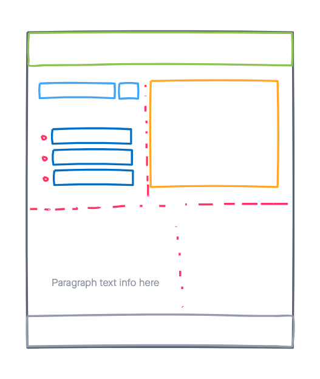

# Project 1.0 (My First API self-project)

## Technologies Used
- HTML5
- CSS3
- Javascript
- jQuery
- Flight API

## What does this application do?
- Gives flight prices of various locations typed by User
- Compares prices of flights
- Directs users to page that tickets can be bought from
- Gives information on what tour experiences should be like!
## Wireframe Layout:

### [Click Here](https://handwidhtv8.github.io/project-1-new/) to see my application in *action!*

##Future Enhancements
- Visuals of locations for users
- more styling of cards 
- expansion of data